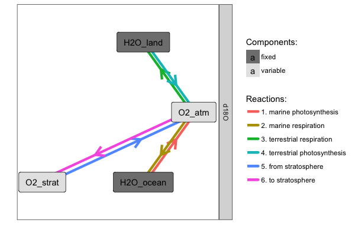

```{r "load packages", include=FALSE}
library(tidyverse)
```

# System



## Equations

At steady-state we know the solution:

$$
\delta_{O2} - \delta_{H2O} = f_m \cdot (\epsilon_{pm} - \epsilon_{rm}) + (1-f_m)\cdot (\epsilon_{meteoric} + \epsilon_{evap} + \epsilon_{pl} - \epsilon_{rl}) + k_{strat}\cdot \epsilon_{ex}
$$

Note: all $\delta$ and $\epsilon$ values are for the fractionation of $^{18}O/^{16}O$. The `Dole Effect` = $\delta_{O2} - \delta_{H2O}$.

## Parameters

 - $f_m$ is the fraction of photosynthsis/respiration happening on land.


# Information

## Marine

 - gross production is 10.6 Pmol/year
 - no isotopic effect from photosynthesis
 - respiration depletes by 18.9‰
 
## Terrestrial

 - gross production is 20.4 Pmol/year
 - average meteoric water is depleted by 7‰
 - evapotransporation causes an effective enrichment of ~11‰
 - respiration depletes by 18.0‰

## Stratospheric exchange

 - the residence time of O2 in the troposphere is 1200 years, the residence time in the stratosphere is 56 years
 - exchange with CO2 in the stratosphere leads to the CO2 getting enriched by 11‰ (i.e. the oxygen gets depleted)
 - the mixing ratio of CO2 and O2 in the stratosphere is assumed to be the same as in the trophosphere

### Question: What is an estimate of the relative flux to the stratosphere ($k_{strat}$)?

### Question: What is the effective isotope effect of stratospheric exchange ($\epsilon_{ex}$)?


# Exploring the analytical solution

```{r}
#' calculates the dole effect (dO2 - dH2O) for the given parameters
#' @param f_m fraction of respiratory (and photosynthetic flux that is marine)
#' @param eps_pl photosynthetic fractionation on land 
#' @param eps_rl respiratory fractionation on land
#' @param eps_pm photosynthetic fractionation in the oceans 
#' @param eps_rm respiratory fractionation on land
#' @param eps_ex fractionation from exchange with CO2 (eps_O2/CO2)
#' @param eps_meteoric fractionation of average meteoric water (relative to ocean)
#' @param strat_flux_m multiplier of stratospheric flux
calc_dole_effect <- function(f_m, eps_pm, eps_rm, eps_pl, eps_rl, eps_ex, eps_evap, eps_meteoric, strat_flux_m) {
  f_m * (eps_pm - eps_rm) + (1 - f_m) * (eps_meteoric + eps_evap + eps_pl - eps_rl) + strat_flux_m * eps_ex
}

# base plot we will use for plotting
p_base <- ggplot() + 
  aes(y = dole_effect) +
  geom_hline(yintercept = 23.5, color = "red", size = 3) +
  geom_line(size = 1.5) +
  scale_y_continuous("Dole effect [\U2030]", expand = c(0,0), limits = c(18, 26)) +
  scale_x_continuous(expand = c(0,0)) +
  theme_bw()
```

## Exercise 1: calculate the modern dole effect

```{r}

```

## Exercise 2: how does it change if we vary the evapotranspiration effect from 5 to 20‰?

```{r}
df1 <- 
  data_frame(
    eps_evap = ?,
    dole_effect = ?
  ) 

p_base %+% df1 %+% aes(x = eps_evap) + 
  labs(x = "isotope effect of evaportranspiration [\U2030]")
```

## Exercise 3: how does it change if we vary the flux fraction of the marine pool from 0% to 100%?

```{r}
df2 <- 
  data_frame(
    ???
  ) 

p_base %+% df2 %+% aes(x = 100 * f_m) + labs(x = "fraction of marine flux [%]")
```

## Exercise 4: how about changing either of the respiratory isotope effects from -15 to -22‰?

Again, let's assume that a more realistic evapotranspiration effect is actually 15‰ instead of 8‰.


```{r}

```


